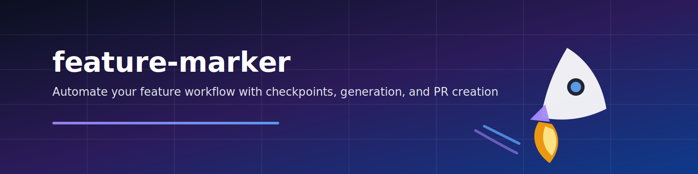

<!-- Banner -->
<p align="center">
  
</p>

<p align="center">
  <strong>Automate your feature development workflow with AI-powered checkpoints</strong>
</p>

<p align="center">
  <a href="#-quick-start">Quick Start</a> •
  <a href="#-features">Features</a> •
  <a href="#-installation">Installation</a> •
  <a href="#-usage">Usage</a> •
  <a href="#-demo">Demo</a>
</p>

<p align="center">
  <a href="https://github.com/Viniciuscarvalho/Feature-marker/blob/main/LICENSE">
    
  </a>
  <a href="https://github.com/Viniciuscarvalho/Feature-marker">
    
  </a>
  <a href="https://github.com/Viniciuscarvalho/Feature-marker">
    
  </a>
  <a href="https://github.com/Viniciuscarvalho/Feature-marker/stargazers">
    
  </a>
</p>

---

**feature-marker** is a Claude Code skill + agent that automates feature development workflows with checkpoints, pause/resume capabilities, artifact generation (PRD/Tech Spec/Tasks), and a final step that creates a commit + PR with automatic platform detection.

Designed to be **platform-agnostic** and compose with existing skills like `creating-pr` and `azure-pr`.

---

## 🎬 Demo

### 📹 Video Explainer (40s)

<p align="center">
  
</p>

> **Note**: Full HD video available in `video-explainer/` directory. See [Video Generation Guide](#-video-generation) to create custom explainer videos.

<details>
<summary>📸 <strong>See more screenshots</strong></summary>

### Inputs Gate - Validating & Generating Artifacts


### Implementation Phase - Task Tracking


### Commit & PR - Platform Detection


</details>

---

## 🆕 What's New

| Version | Date | Highlights |
|---------|------|------------|
| **v1.3.0** | 2026-01-28 | 🤖 AskUserQuestion support in Claude CLI for interactive mode |
| **v1.2.0** | 2026-01-26 | 🔧 Interactive menu TTY fix, template paths corrected |
| **v1.1.0** | 2026-01-19 | 🎯 Interactive execution panel, Ralph Loop mode |
| **v1.0.0** | 2026-01-18 | 🚀 Initial release with 4-phase workflow |

<details>
<summary>📋 <strong>Version Details</strong></summary>

### v1.3.0 - Claude CLI Integration 🤖
- **AskUserQuestion support**: Interactive mode now works seamlessly inside Claude CLI
- **Direct mode selection**: New `--mode` flag to skip menu (`--mode full|tasks-only|ralph-loop`)
- **Cross-environment UX**: Works both in terminal (TTY menu) and Claude CLI (AskUserQuestion)

### v1.2.0 - Bug Fixes
- **Interactive menu TTY detection**: Menu now detects non-terminal environments and provides guidance
- **Template paths corrected**: Commands now use global templates from `~/.claude/docs/`

### v1.1.0 - Interactive Execution Panel 🎯
- **Interactive CLI Panel**: Choose execution mode via beautiful interactive menu
- **Multiple Execution Modes**: Full Workflow, Tasks Only, Ralph Loop
- **Ralph Loop Integration**: Autonomous self-correcting execution

### v1.0.0 - Initial Release
- **No templates required**: All files generated automatically via commands
- **Streamlined paths**: Tasks in `./tasks/` instead of `./docs/tasks/`
- **Smart detection**: Auto-detects existing files, never overwrites

</details>

### How It Works
When you run `/feature-marker prd-{feature-name}`, the workflow:

1. **Checks for existing files** in `./tasks/prd-{feature-name}/`
   - ✅ If `prd.md`, `techspec.md`, and `tasks.md` exist → Proceeds directly to implementation
   - ⚠️ If any file is missing → Generates only the missing files via commands

2. **No duplicates**: Existing files are never overwritten or duplicated
3. **Resume friendly**: You can stop and resume at any time with checkpoint support

---

## ✨ Features

| Feature | Description |
|---------|-------------|
| 🔍 **Validates inputs** | Checks if `prd.md`, `techspec.md`, `tasks.md` exist |
| 🛠️ **Auto-generates** | Creates missing artifacts via `~/.claude/commands/` |
| 📋 **Phased workflow** | Analysis → Implementation → Tests → Commit & PR |
| 💾 **Checkpoint/resume** | Persists state for uninterrupted work |
| 🔀 **Platform detection** | Selects right PR skill (GitHub, Azure DevOps, etc.) |
| ⏸️ **Pause/Resume** | Continue where you left off after interruptions |
| 📊 **Progress tracking** | TodoWrite integration for task management |

---

## 🚀 Quick Start

```bash
# Install
./feature-marker/install.sh

# Then in Claude Code:
/feature-marker prd-user-authentication

# Or use interactive mode (v1.1.0+):
/feature-marker --interactive prd-user-authentication
```

That's it! The skill will guide you through the entire feature development process.

---

## 📦 Installation

### Via install script (recommended)

```bash
# Clone the repository
git clone https://github.com/Viniciuscarvalho/Feature-marker.git
cd Feature-marker

# Run install script
./feature-marker/install.sh

# Verify installation
ls ~/.claude/skills/feature-marker/
ls ~/.claude/agents/feature-marker.md
```

### Manual installation

```bash
# 1. Copy the skill folder
cp -R feature-marker/ ~/.claude/skills/feature-marker/

# 2. Copy the agent
cp agents/feature-marker.md ~/.claude/agents/feature-marker.md

# 3. Set permissions
chmod +x ~/.claude/skills/feature-marker/*.sh
chmod +x ~/.claude/skills/feature-marker/lib/*.sh
```

---

## 📖 Usage

### Basic Usage

In Claude Code, simply invoke:

```
/feature-marker <feature-slug>
```

**Examples:**
```bash
# Start a new feature
/feature-marker prd-user-authentication

# Resume an interrupted workflow
/feature-marker prd-user-authentication  # Will detect checkpoint and offer resume

# Work on multiple features
/feature-marker prd-payment-integration
/feature-marker prd-notification-system
```

### 🎯 Interactive Mode (v1.1.0+)

Launch the interactive panel to choose your execution mode:

```bash
/feature-marker --interactive prd-user-authentication
```

The panel offers **three execution modes**:

#### 1️⃣  Full Workflow Mode (default)
- **Best for**: New features or features with missing files
- **What it does**:
  - Validates existing files
  - Generates missing PRD/TechSpec/Tasks
  - Executes all 4 phases

#### 2️⃣  Tasks Only Mode
- **Best for**: When you already have PRD/TechSpec/Tasks ready
- **What it does**:
  - Skips file generation entirely
  - Goes directly to implementation
  - Requires all files to exist

#### 3️⃣  Ralph Loop Mode
- **Best for**: Autonomous execution with self-correction
- **What it does**:
  - Uses [ralph-wiggum](https://github.com/frankbria/ralph-claude-code) for continuous iteration
  - Self-corrects errors automatically
  - Runs until completion or manual stop
- **Requires**: ralph-wiggum skill installed

**Interactive Panel Preview:**
```
┌──────────────────────────────────────────────────────┐
│         🚀 Feature Marker - Execution Mode           │
└──────────────────────────────────────────────────────┘

  Feature: prd-user-authentication

  Select execution mode:

  1) Full Workflow - Generate PRD/TechSpec/Tasks + Implementation
     → Creates missing files and executes all phases

  2) Execute Tasks Only - Skip generation, run implementation
     → Use existing PRD/TechSpec/Tasks (must exist)

  3) Ralph Loop Mode - Autonomous loop execution
     → Uses ralph-wiggum for continuous iteration

  0) Exit

Select option [0-3]:
```

---

## 🔧 Prerequisites

### Required Commands (for Full Workflow mode)

The following commands must exist in `~/.claude/commands/`:

| Command | Description |
|---------|-------------|
| `create-prd.md` | Creates PRD from requirements discussion |
| `generate-spec.md` | Generates tech spec from PRD |
| `generate-tasks.md` | Breaks down feature into implementable tasks |

> 💡 **Tip:** You can get these commands from [mindkit](https://github.com/Viniciuscarvalho/mindkit) or create your own.

### Optional: Ralph Loop Mode

To use **Ralph Loop Mode** (option 3 in interactive panel):

```bash
# Install ralph-wiggum skill
git clone https://github.com/frankbria/ralph-claude-code.git
cd ralph-claude-code
./install.sh
```

**What is Ralph Loop Mode?**
Based on [Ralph Wiggum pattern](https://ghuntley.com/ralph/), this mode enables autonomous, self-correcting execution where the agent continuously iterates until the feature is complete or an error requires human intervention.

### Project Structure

Your project should follow this structure:

```
your-project/
├── tasks/
│   └── prd-{feature-name}/
│       ├── prd.md            # Generated PRD
│       ├── techspec.md       # Generated tech spec
│       └── tasks.md          # Generated task list
└── .claude/
    └── feature-state/
        └── {feature-name}/
            └── checkpoint.json   # Workflow state
```

---

## 🔄 Workflow Phases

```
┌─────────────────────────────────────────────────────────────────┐
│                    /feature-marker prd-xyz                      │
└─────────────────────────────────────────────────────────────────┘
                              │
                              ▼
┌─────────────────────────────────────────────────────────────────┐
│  🚦 Phase 0: Inputs Gate                                        │
│  ├── 📂 Check ./tasks/prd-{feature-name}/ for existing files    │
│  ├── ✅ All files exist? → Skip to Phase 1                      │
│  ├── ⚠️  Files missing? → Generate ONLY missing files           │
│  │   • prd.md → ~/.claude/commands/create-prd.md               │
│  │   • techspec.md → ~/.claude/commands/generate-spec.md       │
│  │   • tasks.md → ~/.claude/commands/generate-tasks.md         │
│  └── 🔒 Never overwrites existing files                         │
└─────────────────────────────────────────────────────────────────┘
                              │
                              ▼
┌─────────────────────────────────────────────────────────────────┐
│  📋 Phase 1: Analysis & Planning                                │
│  ├── 📖 Read PRD, Tech Spec, Tasks                              │
│  ├── 🗺️ Create implementation plan                              │
│  └── 💾 Save analysis.md, plan.md                               │
└─────────────────────────────────────────────────────────────────┘
                              │
                              ▼
┌─────────────────────────────────────────────────────────────────┐
│  ⚡ Phase 2: Implementation                                      │
│  ├── ✅ Execute tasks with TodoWrite tracking                   │
│  ├── 📝 Make file changes                                       │
│  └── 💾 Save progress.md                                        │
└─────────────────────────────────────────────────────────────────┘
                              │
                              ▼
┌─────────────────────────────────────────────────────────────────┐
│  🧪 Phase 3: Tests & Validation                                 │
│  ├── 🏃 Run test suites (swift test, npm test, etc.)            │
│  ├── 🔨 Validate build                                          │
│  └── 💾 Save test-results.md                                    │
└─────────────────────────────────────────────────────────────────┘
                              │
                              ▼
┌─────────────────────────────────────────────────────────────────┐
│  🚀 Phase 4: Commit & PR                                        │
│  ├── 📝 Create commit with meaningful message                   │
│  ├── 🔍 Detect git platform (GitHub, Azure DevOps, GitLab)      │
│  ├── 🎯 Select appropriate PR skill                             │
│  └── 🔗 Create Pull Request                                     │
└─────────────────────────────────────────────────────────────────┘
```

---

## 🔀 Platform Detection

The skill auto-detects your git platform and selects the appropriate PR skill:

| Platform | Detection Pattern | PR Skill | Status |
|----------|------------------|----------|--------|
| GitHub | `github.com` | `creating-pr` | ✅ Supported |
| Azure DevOps | `dev.azure.com` | `azure-pr` | ✅ Supported |
| GitLab | `gitlab.com` | `creating-pr` | ✅ Supported |
| Bitbucket | `bitbucket.org` | `creating-pr` | ✅ Supported |
| Other | (any) | `creating-pr` | 🔄 Fallback |

> 💡 **Pro tip:** For best results, install the [`creating-pr`](https://www.skillsdirectory.com/skills/udecode-creating-pr) skill.

---

## 💾 Checkpoint & Resume

State is persisted in `.claude/feature-state/{feature-name}/checkpoint.json`.

### How it works

```
You: /feature-marker prd-user-authentication

feature-marker: Checkpoint found!
                Phase 2 in progress (Task 3/6)
                Last updated: 2026-01-19T10:30:00Z
                
                Resume from checkpoint? [Y/n]

You: Y

feature-marker: Resuming from Task 3/6...
```

### Checkpoint data includes

- Current phase and status
- Completed tasks
- Generated artifacts
- Error state (if any)
- Timestamps

---

## ⚙️ Configuration

Override defaults with `.feature-marker.json` in your project root:

```json
{
  "pr_skill": "custom-pr-skill",
  "skip_pr": false,
  "test_command": "npm run test:ci",
  "docs_path": "./tasks",
  "state_path": ".claude/feature-state"
}
```

### Configuration Options

| Option | Default | Description |
|--------|---------|-------------|
| `pr_skill` | Auto-detected | Override PR skill selection |
| `skip_pr` | `false` | Skip PR creation, commit only |
| `test_command` | Auto-detected | Custom test command |
| `docs_path` | `./tasks` | Path to task documents |
| `state_path` | `.claude/feature-state` | Path for checkpoint storage |

---

## 🖥️ CLI Usage

The `feature-marker.sh` script can also be used directly:

```bash
# Show help
./feature-marker/feature-marker.sh --help

# Show status of a feature
./feature-marker/feature-marker.sh --status prd-user-authentication

# Show detected git platform
./feature-marker/feature-marker.sh --platform

# Show version
./feature-marker/feature-marker.sh --version

# Direct mode selection (v1.3.0+) - skip interactive menu
./feature-marker/feature-marker.sh --mode full prd-user-authentication
./feature-marker/feature-marker.sh --mode tasks-only prd-user-authentication
./feature-marker/feature-marker.sh --mode ralph-loop prd-user-authentication
```

### CLI Output Example

```
╔═══════════════════════════════════════╗
║         feature-marker v1.0           ║
╚═══════════════════════════════════════╝

Feature: prd-user-authentication

Checking feature files in ./tasks/prd-user-authentication/...
  ✓ prd.md exists
  ✓ techspec.md exists
  ✓ tasks.md exists

Git Platform Detection:
  Platform: github
  PR Skill: creating-pr
  Skill Status: Available

────────────────────────────────────────

ℹ To start/continue this workflow, use Claude Code:
  /feature-marker prd-user-authentication
```

---

## ❓ Frequently Asked Questions

### Q: What if my files already exist in `./tasks/prd-{feature-name}/`?
**A:** The workflow automatically detects existing files and **never** overwrites them. It will:
- ✅ Read existing `prd.md`, `techspec.md`, and `tasks.md`
- ✅ Proceed directly to Phase 1 (Analysis & Planning)
- ✅ Skip file generation entirely

### Q: Can I have partial files (e.g., only PRD exists)?
**A:** Yes! The workflow generates **only the missing files**. For example:
- If you have `prd.md` but not `techspec.md` → Generates only `techspec.md`
- If you have all three → Skips generation and proceeds to implementation

### Q: Where should my task files be located?
**A:** All task files should be in:
```
./tasks/prd-{feature-name}/
├── prd.md
├── techspec.md
└── tasks.md
```
Note: The path is `./tasks/` in the project root, **not** `./docs/tasks/`

### Q: Do I need template files?
**A:** No! Templates are no longer required. All files are generated dynamically via commands in `~/.claude/commands/`

### Q: How do I migrate from the old `docs/tasks/` structure?
**A:** Simply move your files:
```bash
mv docs/tasks/* tasks/
rm -rf docs/tasks/ docs/specs/
```

---

## 🔧 Troubleshooting

| Issue | Solution |
|-------|----------|
| Task generation needs approval | `generate-tasks.md` requires preview approval before writing |
| No PR skill for platform | Falls back to `creating-pr`; if unavailable, commits only |
| Checkpoint corrupted | Delete `.claude/feature-state/{feature}/checkpoint.json` |
| Commands not found | Ensure commands exist in `~/.claude/commands/` |

---

## 🔄 Update / Uninstall

### Update

```bash
cd Feature-marker
git pull
./feature-marker/install.sh
```

### Uninstall

```bash
rm -rf ~/.claude/skills/feature-marker/
rm ~/.claude/agents/feature-marker.md
```

---

## 🎥 Video Generation

Want to create your own explainer video or customize the existing one?

### Prerequisites

```bash
# Install Node.js 18+ and npm/bun/pnpm
# Then navigate to video project
cd video-explainer
npm install  # or bun install / pnpm install
```

### Preview Video

```bash
npm start
```

Opens Remotion Studio at `http://localhost:3000` where you can:
- Preview all scenes in real-time
- Adjust timings and animations
- Test different configurations

### Render Video (MP4)

```bash
# Full HD quality
npm run build -- FeatureMarkerExplainer --codec h264

# Output: out/FeatureMarkerExplainer.mp4
```

### Create Optimized GIF for README

```bash
# 1. Render at smaller resolution (40 seconds, 1.5x faster)
npm run build -- FeatureMarkerExplainer --scale 0.5 --codec h264

# 2. Convert to optimized GIF (requires ffmpeg)
# 720px width, 128 colors, Bayer dithering for smaller file size
ffmpeg -i out/FeatureMarkerExplainer.mp4 \
  -vf "fps=15,scale=720:-1:flags=lanczos,split[s0][s1];[s0]palettegen=max_colors=128[p];[s1][p]paletteuse=dither=bayer:bayer_scale=5" \
  -loop 0 out/feature-marker-demo.gif

# 3. Copy to assets folder
cp out/feature-marker-demo.gif ../assets/feature-marker-demo.gif
```

**Optimizations applied:**
- **Faster playback**: 40s video (was 60s) for more engaging viewing
- **Smaller file**: 720px width with 128-color palette (reduced from 960px/256 colors)
- **Better compression**: Bayer dithering reduces banding artifacts
- **Infinite loop**: Automatically replays in README

### Customize Video

All scenes are in `video-explainer/src/compositions/`:
- `IntroScene.tsx` - Logo and tagline
- `BasicCommandScene.tsx` - Command demonstration
- `InteractivePanelScene.tsx` - Menu showcase
- `WorkflowScene.tsx` - Progress indicators
- `OutroScene.tsx` - CTA and GitHub link

Edit these files to:
- Change colors and branding
- Adjust animation timing
- Update text content
- Add new scenes

See full documentation: [`video-explainer/README.md`](video-explainer/README.md)

---

## 🤝 Contributing

Contributions are welcome! Feel free to:

1. Fork the repository
2. Create a feature branch (`git checkout -b feature/amazing-feature`)
3. Commit your changes (`git commit -m 'Add amazing feature'`)
4. Push to the branch (`git push origin feature/amazing-feature`)
5. Open a Pull Request

---

## 📄 License

MIT © [Vinicius Carvalho](https://github.com/Viniciuscarvalho)

---

<p align="center">
  
  <br>
  Built with 🤖 for the AI-assisted development community
</p>
