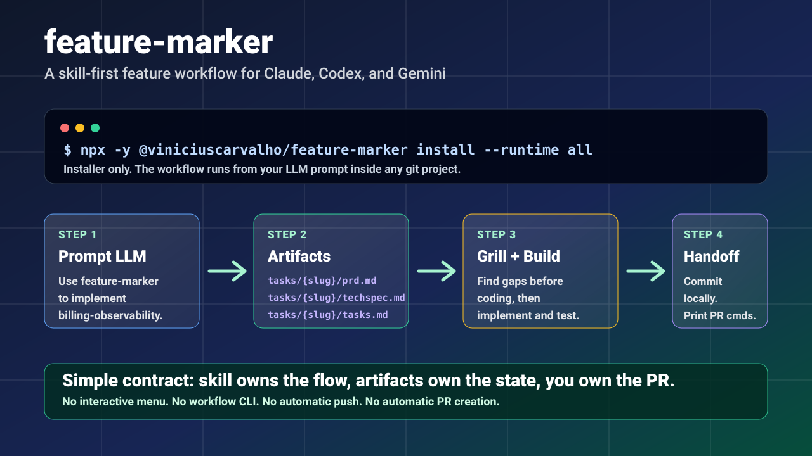

# feature-marker - Skill-first feature workflow for Claude, Codex, and Gemini


[](https://www.npmjs.com/package/@viniciuscarvalho/feature-marker)
[](LICENSE)
[](https://nodejs.org/)
[](https://www.anthropic.com/claude-code)
[](https://openai.com/codex/)
[](https://gemini.google.com/)

feature-marker is a portable LLM skill for turning one feature request into a
clear flow: PRD, TechSpec, Tasks, implementation, verification, local commit,
and branch handoff.

The npm package is only an installer for skill files. It does not run the
workflow, own feature state, push branches, or open pull requests.



## Why Star This Repo

- Works where you already code: Claude, Codex, and Gemini.
- Keeps the workflow simple: install once, then invoke the skill from a prompt.
- Produces plain repo artifacts your team can review and keep.
- Adds an implementation grill before coding so weak specs, missing tests, and
  handoff gaps are found early.
- Stops at a clean local branch handoff. You stay in control of push and PR
  creation.

## Install With npx

Install for Claude:

```bash
npx -y @viniciuscarvalho/feature-marker install --runtime claude
```

Install the skill into all supported runtimes:

```bash
npx -y @viniciuscarvalho/feature-marker install --runtime all
```

Install only one runtime:

```bash
npx -y @viniciuscarvalho/feature-marker install --runtime codex
npx -y @viniciuscarvalho/feature-marker install --runtime gemini
```

Use `--dry-run` to preview install targets:

```bash
npx -y @viniciuscarvalho/feature-marker install --runtime all --dry-run
```

Global npm install is optional and only shortens the installer command:

```bash
npm install -g @viniciuscarvalho/feature-marker
feature-marker install --runtime codex
```

## Use In Your LLM

After installation, open any git project in Claude, Codex, or Gemini and invoke
the skill from the prompt. Interactive mode is not required and is not the v1
path.

Claude prompt:

```text
Use feature-marker to implement billing-observability.
```

Codex or Gemini prompt:

```text
Use feature-marker to plan and implement billing-observability.
```

```text
Use feature-marker in tasks-only mode for billing-observability.
```

```text
Use feature-marker to create only the PRD for import-csv.
```

The skill reads the repository, creates or uses artifacts under `tasks/{slug}/`,
runs through PRD -> TechSpec -> Tasks -> implementation grill ->
implementation -> verification, commits locally, and prints exact push/PR
handoff commands. The grill pass finds gaps before coding; it asks the user only
when a finding changes scope or requires a product decision.

PRD, TechSpec, and Tasks are created from bundled templates installed with the
skill. The agent fills `{slug}` and `{feature_title}` and writes:
`tasks/{slug}/prd.md`, `tasks/{slug}/techspec.md`, and
`tasks/{slug}/tasks.md`.

## Installer Commands

| Command | What it does |
| --- | --- |
| `install --runtime claude\|codex\|gemini\|all` | Installs skill assets for the selected runtime. |
| `install --runtime all --dry-run` | Shows install targets without writing files. |
| `--help` | Prints installer usage. |
| `--version` | Prints the package version. |

Workflow commands such as `run`, `resume`, `status`, and `capabilities` are not
supported. Invoke feature-marker inside your LLM instead.

## Workflow Contract

feature-marker keeps user-facing state in plain artifacts:

```text
tasks/{slug}/
  prd.md
  techspec.md
  tasks.md
```

The skill is branch-first:

- Create or require a feature branch before implementation.
- Use a worktree only when the current checkout is dirty or the user asks.
- Continue from PRD to TechSpec to Tasks to an implementation grill by default.
- Resolve grill findings in the artifacts before coding.
- Stop only for true ambiguity, unrelated dirty work, or blocked verification.
- Preserve unrelated local changes.
- Finish with a local commit and exact handoff commands.
- Do not push or open a PR automatically.

Example handoff:

```bash
git push -u origin feature-marker/billing-observability
gh pr create --base main --head feature-marker/billing-observability
```

## Prompt Intents

There are no CLI workflow modes. Use these words in your LLM prompt when useful:

| Intent | What the skill does |
| --- | --- |
| `full` | Runs PRD, TechSpec, Tasks, implementation grill, implementation, tests, and branch handoff. |
| `tasks-only` | Uses existing artifacts, implements tasks, tests, and hands off. |
| `test-only` | Runs verification on the current feature branch and reports results. |
| `prd-only` | Creates or revises only `tasks/{slug}/prd.md`. |

`spec-driven` and `ralph-loop` are out of scope for this skill-first v1 unless
they are rebuilt as explicit skill instructions.

## Runtime Install Targets

- Claude: `~/.claude/skills/feature-marker` and `~/.claude/agents/feature-marker.md`
- Codex: `~/.codex/skills/feature-marker`
- Gemini: `~/.gemini/skills/feature-marker`

## Verification

Run the deterministic suite:

```bash
npm test
```

Package smoke:

```bash
npm pack --dry-run --json
```

## Learn More

- Distribution notes: [feature-marker-dist/README.md](feature-marker-dist/README.md)
- Project context: [CONTEXT.md](CONTEXT.md)
- Architecture decision: [docs/adr/012-skill-first-workflow.md](docs/adr/012-skill-first-workflow.md)

## License

MIT
