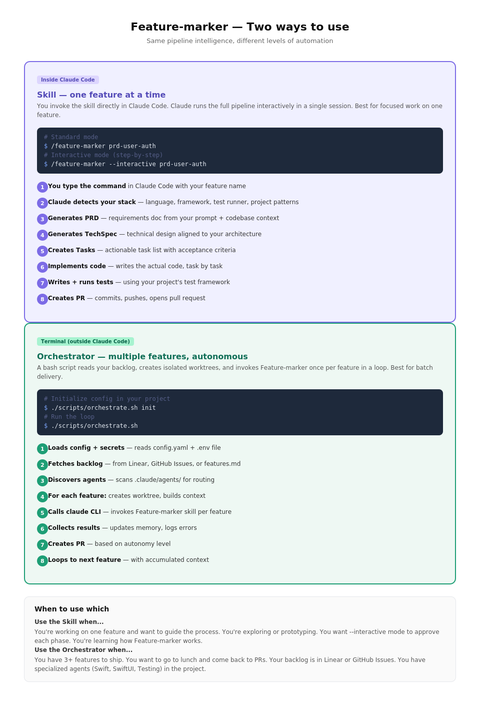
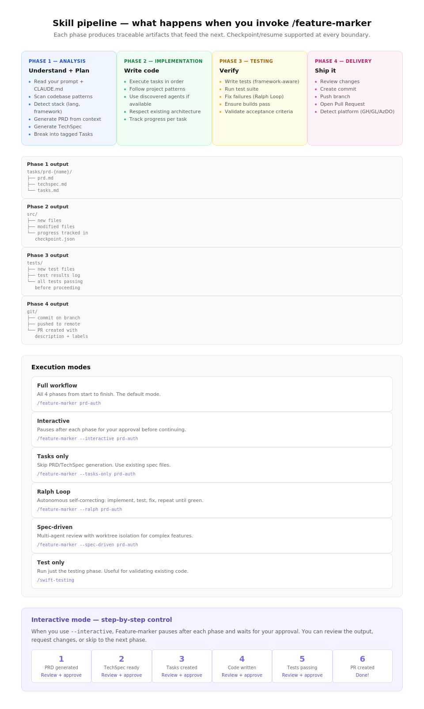
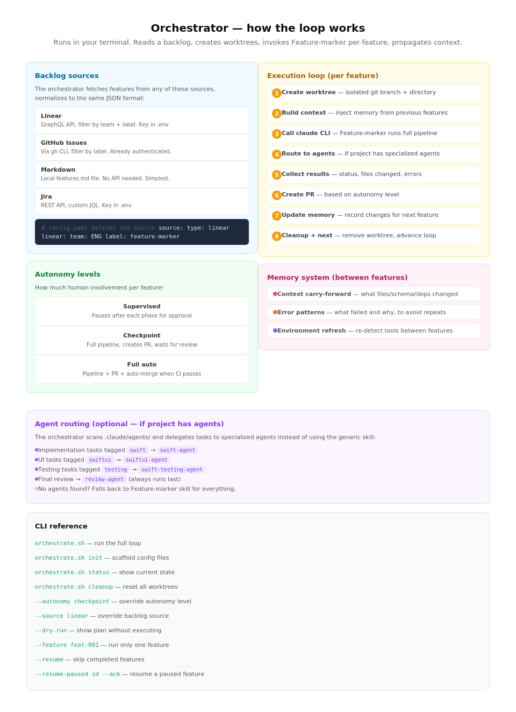
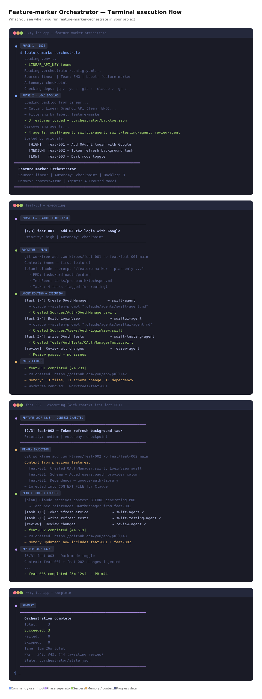

# How Feature-marker Works

Feature-marker has two distinct ways to use it. Both use the same pipeline intelligence — the difference is **who controls the loop**.



---

## Path 1: The Skill (inside Claude Code)

You invoke Feature-marker directly in Claude Code. Claude runs the full pipeline in a single interactive session. This is the simplest way to use it — one feature, one command.

```bash
# Standard mode — runs all phases automatically
/feature-marker prd-user-authentication

# Interactive mode — pauses after each phase for your approval
/feature-marker --interactive prd-user-authentication
```

### The pipeline

Every feature goes through 4 phases. Each phase produces artifacts that feed the next.



### Phase 1 — Analysis

Feature-marker reads your prompt, scans your codebase, and generates three documents:

1. **PRD** — What to build and why. Extracted from your prompt, CLAUDE.md constraints, and codebase context.
2. **TechSpec** — How to build it. Aligned to your existing architecture, naming conventions, and patterns.
3. **Tasks** — What to do, step by step. Each task has acceptance criteria and file references.

Output location:

```
tasks/prd-{feature-name}/
├── prd.md
├── techspec.md
└── tasks.md
```

### Phase 2 — Implementation

Feature-marker executes each task from `tasks.md`. It writes code following your project's patterns — the same naming conventions, file structure, error handling, and config management it detected in Phase 1.

If the project has specialized agents in `.claude/agents/` (like a Swift agent or a SwiftUI agent), the orchestrator can route specific tasks to them. In standalone skill mode, Feature-marker handles everything itself.

### Phase 3 — Testing

Tests are written using your project's test framework (detected automatically — Swift Testing, XCTest, Jest, pytest, etc.). Feature-marker runs the tests, and if any fail, it enters the Ralph Loop: fix the failure, re-run, repeat until green.

### Phase 4 — Delivery

Feature-marker commits the changes, pushes the branch, and creates a Pull Request. It auto-detects your platform (GitHub, GitLab, Azure DevOps) and uses the appropriate CLI.

### Interactive mode

When you use `--interactive`, Feature-marker pauses after each phase and shows you the output. You can:

- **Approve** — continue to the next phase
- **Request changes** — ask Claude to modify the output before continuing
- **Skip** — move to the next phase without changes

This gives you full control over the process while still automating the heavy lifting.

### Execution modes

| Mode          | Command                                  | Description                                 |
| ------------- | ---------------------------------------- | ------------------------------------------- |
| Full workflow | `/feature-marker prd-auth`               | All 4 phases, start to finish               |
| Interactive   | `/feature-marker --interactive prd-auth` | Pause after each phase for approval         |
| Tasks only    | `/feature-marker --tasks-only prd-auth`  | Skip PRD/TechSpec, use existing spec files  |
| Ralph Loop    | `/feature-marker --ralph prd-auth`       | Autonomous: implement → test → fix → repeat |
| Spec-driven   | `/feature-marker --spec-driven prd-auth` | Multi-agent review with worktree isolation  |
| Test only     | `/swift-testing`                         | Run just the testing phase                  |

### Checkpoint and resume

You can pause at any time. Feature-marker saves its state to `checkpoint.json`. When you resume, it picks up exactly where it left off — no rework.

```
.claude/feature-state/{feature-name}/
├── checkpoint.json    # Current phase + task progress
├── analysis.md        # Phase 1 output summary
├── plan.md            # Execution plan
├── progress.md        # Task completion tracking
└── test-results.md    # Phase 3 results
```

---

## Path 2: The Orchestrator (terminal)

The orchestrator is a bash script that runs **outside** Claude Code, in your regular terminal. It reads a backlog, creates isolated git worktrees, and invokes Feature-marker once per feature in a loop. You run one command and walk away — it creates PRs for each feature.

```bash
# First time: scaffold config files
./scripts/orchestrate.sh init

# Run the orchestration loop
./scripts/orchestrate.sh run

# Or with Homebrew
feature-marker-orchestrate init
feature-marker-orchestrate run
```



### How it works step by step

The orchestrator is a `for` loop in bash. For each feature in the backlog, it calls `claude --skill feature-marker` to run the pipeline. When Claude finishes, control returns to bash — it collects results and updates memory. Once all features finish, the loop creates PRs and cleans up worktrees in a single pass.



### Setting up

**1. Initialize** — creates config files in your project:

```bash
./scripts/orchestrate.sh init
# Creates:
#   .orchestrator/config.yaml   — settings (committed to git)
#   .env.example                — API key template (committed)
#   .gitignore entries          — protects secrets and state
```

**2. Configure your backlog source** — edit `.orchestrator/config.yaml`:

```yaml
source:
  type: linear # linear | github | jira | markdown
  linear:
    team: ENG
    label: feature-marker
```

**3. Add your API keys** — copy the template and fill in your keys:

```bash
cp .env.example .env
# Edit .env with your keys (never committed)
```

**4. Define your backlog** — depends on source type:

For `markdown` (simplest, no API needed):

```markdown
# features.md

## [HIGH] feat-001: Add OAuth2 login with Google

Implement Google OAuth2 login flow with token refresh.
labels: auth, backend

## [MEDIUM] feat-002: Webhook retry with backoff

Add retry logic to the webhook dispatcher.
depends-on: none

## [LOW] feat-003: Dark mode toggle

Add dark mode toggle to settings page.
```

For `linear` or `github`, the orchestrator fetches issues automatically based on your config.

**5. Preview** — see what would happen without executing:

```bash
./scripts/orchestrate.sh run --dry-run
```

**6. Run**:

```bash
./scripts/orchestrate.sh run
```

### Backlog sources

The orchestrator supports multiple backlog sources. Each uses an **adapter** — a small script that calls the API and normalizes features into the same JSON format. The orchestrator itself never talks to Linear/GitHub directly.

| Source            | Config           | What it needs                                |
| ----------------- | ---------------- | -------------------------------------------- |
| **Linear**        | `type: linear`   | `LINEAR_API_KEY` in `.env`                   |
| **GitHub Issues** | `type: github`   | `gh` CLI authenticated                       |
| **Jira**          | `type: jira`     | `JIRA_API_TOKEN` + `JIRA_BASE_URL` in `.env` |
| **Markdown**      | `type: markdown` | A `features.md` file in your project         |

All API keys live in `.env` (never committed). The `config.yaml` only has parameters (team name, label, JQL query) — safe to commit.

### Autonomy levels

| Level                    | What happens                                                             | Best for                            |
| ------------------------ | ------------------------------------------------------------------------ | ----------------------------------- |
| **Supervised**           | Full pipeline with `--interactive`; pauses after each phase for approval | New projects, critical features     |
| **Checkpoint** (default) | Full pipeline, creates draft PR, waits for human review to merge         | Established projects                |
| **Full auto**            | Full pipeline, creates PR, auto-merges when CI passes                    | Low-risk features, batch operations |

Override per run:

```bash
./scripts/orchestrate.sh run --autonomy full_auto
```

### Memory between features

The orchestrator keeps three layers of context that accumulate as features complete:

**Context carry-forward** — After feat-001 finishes, the orchestrator records what files were created, what schema changed, what dependencies were added. When feat-002 starts, this context is injected into the Claude session _before_ generating the PRD. So feat-002's TechSpec can reference code from feat-001.

**Error patterns** — When a feature fails, the error is logged with context. Subsequent features receive these patterns so they can proactively avoid the same issues.

**Environment refresh** — Between features, the orchestrator can re-detect installed tools, new dependencies, and changed project structure.

### Agent routing

If your project has specialized agents in `.claude/agents/`, the orchestrator discovers them and delegates tasks to the most appropriate agent instead of using the generic Feature-marker skill for everything.

For example, in a Swift/iOS project:

```
.claude/agents/
├── swift-agent.md           # Swift implementation
├── swiftui-agent.md         # SwiftUI views
├── swift-testing-agent.md   # Swift Testing framework
└── review-agent.md          # Code review
```

When a feature generates tasks, the orchestrator matches each task's tags to agent capabilities:

- Implementation task tagged `swift` → `swift-agent`
- UI task tagged `swiftui` → `swiftui-agent`
- Testing task → `swift-testing-agent`
- Review (always last) → `review-agent`

If no agents are found, Feature-marker handles everything — the system degrades gracefully.

### CLI reference

**Subcommands:**

```bash
./scripts/orchestrate.sh run          # Execute the orchestration loop
./scripts/orchestrate.sh init         # Scaffold config files
./scripts/orchestrate.sh status       # Show current state
./scripts/orchestrate.sh clean        # Remove worktrees + reset state
```

**Flags:**

```bash
--autonomy <level>     # supervised | checkpoint | full_auto
--adapter <type>       # linear | github | jira | markdown
--dry-run              # Show plan without executing (use with run)
--feature <id>         # Run only one feature
--resume-paused <id>   # Resume a paused feature from its checkpoint
--config <path>        # Use a different config file
```

---

## How the two paths relate

```
┌─────────────────────────────────────────────────────┐
│              Your terminal                           │
│                                                      │
│  ./scripts/orchestrate.sh run                        │
│     │                                                │
│     ├─ reads config.yaml + .env                      │
│     ├─ fetches backlog (Linear / GitHub / .md)       │
│     ├─ for each feature:                             │
│     │    ├─ git worktree add                         │
│     │    ├─ claude --skill feature-marker            │ ← calls Claude Code
│     │    │         prd-<feat-id>                     │
│     │    │    └─ Feature-marker skill runs           │ ← same skill as Path 1
│     │    │       PRD → TechSpec → Tasks → Code       │
│     │    │       → Tests → PR → (returns to bash)    │
│     │    │                                           │
│     │    ├─ collect results                          │
│     │    └─ update memory                            │
│     │                                                │
│     ├─ create PRs + cleanup worktrees (post-loop)    │
│     └─ next feature (with accumulated context)       │
│                                                      │
└──────────────────────────────────────────────────────┘
```

The orchestrator calls the **same skill** that you invoke manually with `/feature-marker`. The difference is that the bash script controls the loop, worktrees, and memory — Claude only sees one feature at a time. This means the skill works identically whether you invoke it directly in Claude Code or the orchestrator calls it via `claude` CLI.

---

## Quick start

### Just the skill (one feature)

```bash
# 1. Install
npx @viniciuscarvalho/feature-marker install

# 2. Open Claude Code in your project

# 3. Invoke
/feature-marker --interactive prd-user-authentication
```

### Orchestrator (multiple features)

```bash
# 1. Install
brew tap viniciuscarvalho/tap
brew install feature-marker

# 2. Initialize in your project
cd your-project
feature-marker-orchestrate init

# 3. Configure
vim .orchestrator/config.yaml    # Set source type
cp .env.example .env && vim .env # Add API keys
vim features.md                  # Define backlog

# 4. Preview
feature-marker-orchestrate run --dry-run

# 5. Run
feature-marker-orchestrate run
```
